# Bài giảng: Đánh giá các biểu diễn hình ảnh cho nhận dạng bảng chữ cái ASL tĩnh

## Mục lục

1. [Giới thiệu bài toán](#1-giới-thiệu-bài-toán)
2. [Kiến trúc tổng quan pipeline](#2-kiến-trúc-tổng-quan-pipeline)
3. [Tầng 1: Enhancement — Tiền xử lý ảnh](#3-tầng-1-enhancement--tiền-xử-lý-ảnh)
4. [Tầng 2: Representation — Trích xuất đặc trưng](#4-tầng-2-representation--trích-xuất-đặc-trưng)
5. [Tầng 3: Classifier — Phân loại](#5-tầng-3-classifier--phân-loại)
6. [Ma trận thí nghiệm 25 pipeline](#6-ma-trận-thí-nghiệm-25-pipeline)
7. [Kết quả và phân tích](#7-kết-quả-và-phân-tích)
8. [Kết luận](#8-kết-luận)

---

## 1. Giới thiệu bài toán

### 1.1 Định nghĩa

Nhận dạng bảng chữ cái ngôn ngữ ký hiệu Mỹ (ASL) dưới dạng **phân loại ảnh tĩnh 26 lớp**:

```
Đầu vào:  Ảnh RGB chứa một cử chỉ tay
Đầu ra:   Một trong 26 chữ cái A-Z
```

> **Lưu ý**: Trong ASL thực tế, J và Z là ký hiệu động (cần chuyển động tay). Project này xử lý chúng như lớp tĩnh cho mục đích demo.

### 1.2 Câu hỏi nghiên cứu

> Liệu tiền xử lý ảnh (image enhancement) có thực sự cải thiện độ chính xác nhận dạng ASL, hay nó chỉ thêm phức tạp và thậm chí làm giảm hiệu suất?

### 1.3 Tại sao câu hỏi này quan trọng

Trong demo webcam thực tế, ảnh đầu vào chịu nhiều yếu tố:
- Ánh sáng yếu, không đồng đều
- Nền phức tạp, lộn xộn
- Tay bị mờ do chuyển động
- Camera chất lượng thấp

Câu hỏi tự nhiên: **nếu ta "làm đẹp" ảnh trước, liệu nhận dạng có tốt hơn?**

---

## 2. Kiến trúc tổng quan pipeline

### 2.1 Thiết kế 3 tầng

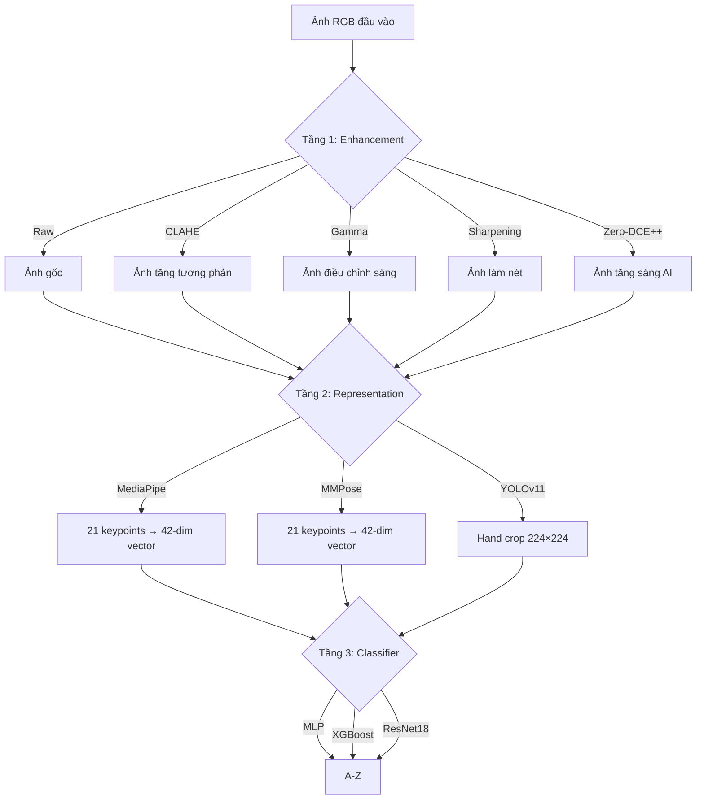

### 2.2 Điểm khác biệt so với thiết kế cũ

Thiết kế **cũ** (pipeline phẳng):
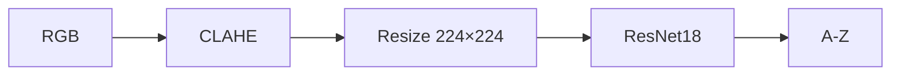

Enhancement **thay thế** detection — ảnh enhanced đưa thẳng vào classifier mà không detect tay.

Thiết kế **mới** (pipeline chuỗi):
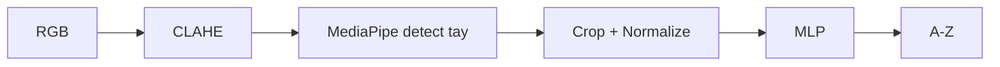

Enhancement chạy **TRƯỚC** detection — kiểm tra xem enhancement có giúp detector tìm tay tốt hơn không.

---

## 3. Tầng 1: Enhancement — Tiền xử lý ảnh

### 3.1 Tổng quan

Enhancement module nhận ảnh RGB thô và biến đổi nó để (hy vọng) cải thiện chất lượng cho các bước tiếp theo.

### 3.2 Raw (không enhancement)

Nhóm đối chứng — ảnh giữ nguyên, không biến đổi gì.

```python
def apply_raw(img):
    return img  # pass-through
```

### 3.3 CLAHE (Contrast Limited Adaptive Histogram Equalization)

**Lý thuyết**: Histogram Equalization cân bằng phân bố cường độ pixel để tăng tương phản. CLAHE giới hạn mức khuếch đại (clip limit) trên từng vùng nhỏ (tile) để tránh khuếch đại nhiễu quá mức.

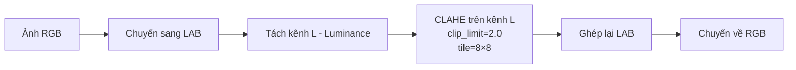

**Công thức**: Với histogram $h(i)$ trên mỗi tile, CLAHE giới hạn:

$$h_{clipped}(i) = \min(h(i), \text{clip\_limit})$$

Phần dư được phân bổ đều cho các bin khác.

**Ưu điểm**: Tăng tương phản cục bộ, hiệu quả cho ảnh tối thiếu sáng.

**Nhược điểm**: Tạo artifact ở vùng nền đồng nhất → làm MediaPipe nhầm nền thành tay → **tăng gấp đôi detection failure rate** (17% → 35%).

### 3.4 Gamma Correction

**Lý thuyết**: Điều chỉnh độ sáng phi tuyến dựa trên luỹ thừa.

$$I_{out} = I_{in}^{1/\gamma}$$

- $\gamma > 1$: Ảnh sáng hơn (nâng vùng tối)
- $\gamma < 1$: Ảnh tối hơn (giảm vùng sáng)
- $\gamma = 1$: Không thay đổi

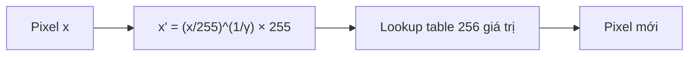

**Ưu điểm**: Đơn giản, nhanh (lookup table), ít artifact hơn CLAHE.

**Nhược điểm**: Biến đổi toàn cục — không phân biệt vùng tay vs vùng nền.

### 3.5 Sharpening

**Lý thuyết**: Tăng cường cạnh bằng bộ lọc tích chập (convolution kernel).

Kernel sharpening tiêu chuẩn:

$$K = \begin{bmatrix} 0 & -1 & 0 \\ -1 & 5 & -1 \\ 0 & -1 & 0 \end{bmatrix}$$

Kernel này = Identity + Laplacian, tức **ảnh gốc + biên**:

$$I_{sharp} = I * K = I + \nabla^2 I$$

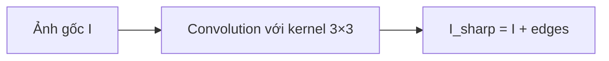

**Ưu điểm**: Tăng nét đường viền ngón tay → lý thuyết giúp keypoint detection.

**Nhược điểm**: **Khuếch đại nhiễu** — trong điều kiện ánh sáng yếu, nhiễu bị nhân lên cùng cạnh → phá hủy low-light robustness (10.10% trên raw→ResNet18, 5.40% trên landmarks).

### 3.6 Zero-DCE++ (Learned Enhancement)

**Lý thuyết**: Mạng neural siêu nhẹ (10,561 tham số) học **đường cong điều chỉnh pixel** (pixel-wise tone curve) theo cách unsupervised — không cần ảnh paired (tối/sáng).

#### Kiến trúc

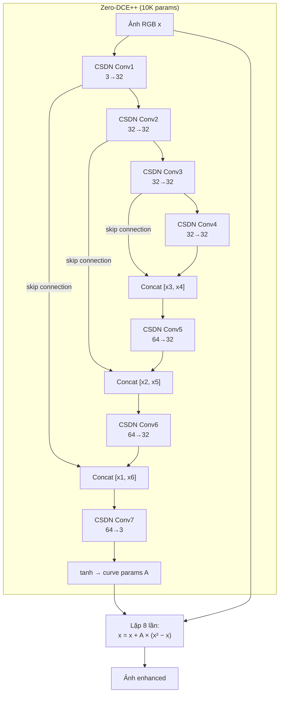

**CSDN** = Depthwise Separable Convolution:

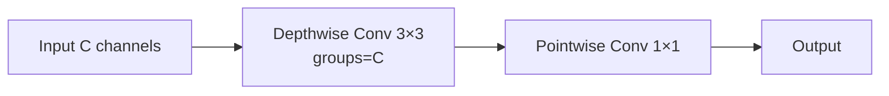

Depthwise separable giảm tham số từ $C_{in} \times C_{out} \times 9$ xuống $C_{in} \times 9 + C_{in} \times C_{out}$, đó là lý do chỉ có 10K params.

#### Hàm cập nhật đường cong

Ảnh được enhance qua 8 lần lặp:

$$x_{t+1} = x_t + A \cdot (x_t^2 - x_t)$$

Trong đó $A$ là tham số đường cong (output của mạng, $A \in [-1, 1]$ do tanh).

- Khi $A > 0$ và $x$ nhỏ (vùng tối): $x^2 - x < 0$ → $x$ tăng → **làm sáng vùng tối**
- Khi $A > 0$ và $x$ lớn (vùng sáng): $x^2 - x > 0$ → $x$ giảm → **giảm vùng quá sáng**

#### Hàm loss (unsupervised)

Zero-DCE++ không cần ground truth. Loss bao gồm 4 thành phần:

$$\mathcal{L} = \mathcal{L}_{spa} + \mathcal{L}_{exp} + \mathcal{L}_{col} + \mathcal{L}_{tv}$$

| Loss | Ý nghĩa |
|------|---------|
| $\mathcal{L}_{spa}$ (Spatial Consistency) | Giữ quan hệ không gian giữa vùng lân cận |
| $\mathcal{L}_{exp}$ (Exposure) | Đưa exposure trung bình về mức mong muốn |
| $\mathcal{L}_{col}$ (Color Constancy) | Giữ cân bằng màu, không tạo color cast |
| $\mathcal{L}_{tv}$ (Total Variation) | Đảm bảo curve params mượt, tránh artifact |

**Tại sao phù hợp cho ASL**: Không tạo artifact giả → không làm detector nhầm → **giảm** detection failure rate (17.15% → 14.50%) thay vì tăng như CLAHE/Gamma.

---

## 4. Tầng 2: Representation — Trích xuất đặc trưng

### 4.1 Hai paradigm: Geometric vs Appearance

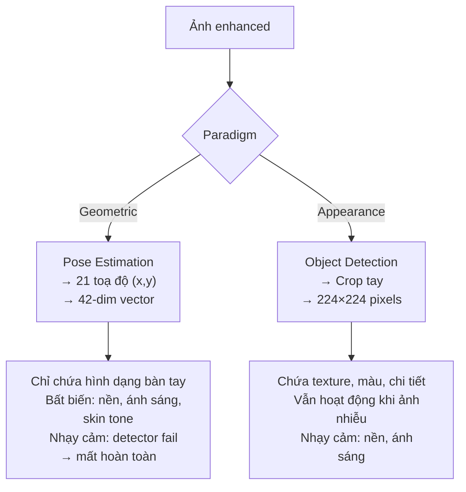

### 4.2 MediaPipe Hand Landmarker

#### Kiến trúc

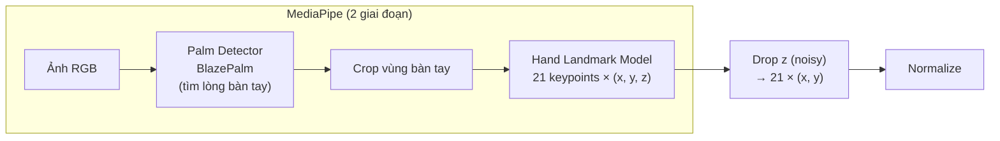

**21 keypoints** theo chuẩn MediaPipe:

```
Landmark 0:  Cổ tay (WRIST)
Landmark 1-4:  Ngón cái (THUMB: CMC, MCP, IP, TIP)
Landmark 5-8:  Ngón trỏ (INDEX: MCP, PIP, DIP, TIP)
Landmark 9-12: Ngón giữa (MIDDLE: MCP, PIP, DIP, TIP)
Landmark 13-16: Ngón áp út (RING: MCP, PIP, DIP, TIP)
Landmark 17-20: Ngón út (PINKY: MCP, PIP, DIP, TIP)
```

#### Chuẩn hoá (Normalization)

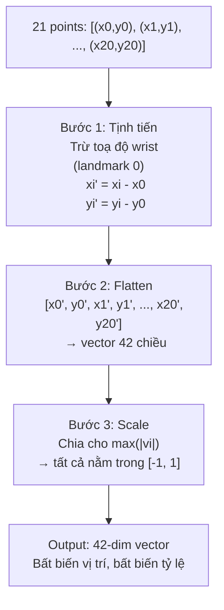

**Tại sao drop z?** MediaPipe ước lượng z (độ sâu) từ ảnh 2D — kết quả rất noisy và không nhất quán giữa các frame. Project cv2 từng thử dùng z (63-dim, v2) nhưng accuracy **giảm** trên webcam thực → revert về 42-dim (v3).

#### Đặc điểm
- **Fail rate**: 17.15% trên ASL Kaggle test (ảnh sáng, nền sạch). Cao hơn nữa trên webcam thực.
- **Tốc độ**: ~30 FPS trên CPU
- **Ưu điểm**: Bất biến nền, ánh sáng, skin tone
- **Nhược điểm**: Phụ thuộc hoàn toàn vào Palm Detector — nếu bước 1 fail thì mất toàn bộ dữ liệu

### 4.3 MMPose RTMPose-Hand

#### Kiến trúc

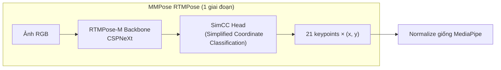

**Khác biệt so với MediaPipe**:

| Tiêu chí | MediaPipe | MMPose RTMPose |
|----------|-----------|----------------|
| Kiến trúc | 2 giai đoạn (palm detect → landmarks) | 1 giai đoạn (direct regression) |
| Input | Crop từ palm detector | Full image hoặc bbox |
| Fail mode | Palm detector miss → fail hoàn toàn | Luôn output keypoints, nhưng có thể noisy |
| Fail rate | 17.15% | ~5.80% (ước tính) |
| Training data | In-house Google | Hand5 (FreiHAND + OneHand10K + ...) |
| Cài đặt | `pip install mediapipe` | `pip install mmpose mmcv mmdet mmengine` |

**SimCC Head**: Thay vì regression trực tiếp toạ độ (x, y), SimCC phân loại toạ độ x và y riêng biệt thành bins rời rạc, sau đó nội suy. Điều này ổn định hơn direct regression.

### 4.4 YOLOv11 Hand Crop

#### Kiến trúc

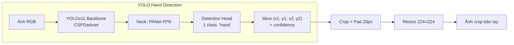

**Khác biệt cơ bản**: Output là **ảnh 224×224**, không phải vector toạ độ. Điều này cho phép dùng classifier CNN (ResNet18) thay vì MLP/XGBoost.

**Ưu điểm**:
- Ảnh crop vẫn chứa texture, chi tiết da tay, hình dạng ngón
- CNN có thể phân loại ngay cả khi ảnh mờ/nhiễu (vì pattern texture vẫn phân biệt được)
- Low-light robustness tốt hơn landmarks (42.30% vs 0.00% ở baseline)

**Nhược điểm**:
- Phụ thuộc vào nền (nền sáng/tối ảnh hưởng classifier)
- Crop size ảnh hưởng accuracy (crop quá to → có nền, quá nhỏ → cắt ngón)

---

## 5. Tầng 3: Classifier — Phân loại

### 5.1 MLP (Multi-Layer Perceptron)

#### Kiến trúc

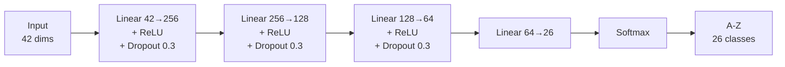

**Đầu vào**: Vector 42 chiều (toạ độ normalized).

**Hàm loss**: Cross Entropy

$$\mathcal{L}_{CE} = -\sum_{c=1}^{26} y_c \log(\hat{y}_c)$$

Các biến thể được thí nghiệm:
- **Label Smoothing CE**: $y_c = (1 - \epsilon) \cdot \mathbf{1}[c = y^*] + \epsilon / 26$, với $\epsilon = 0.1$
- **Focal Loss**: $\mathcal{L}_{FL} = -(1-\hat{y}_c)^\gamma \log(\hat{y}_c)$, với $\gamma = 2.0$
- **Weighted CE**: Nhân trọng số nghịch đảo tần suất lớp

**Đặc điểm**: Nhanh train (~1 phút cho 4K samples), dễ hiểu, baseline chuẩn.

### 5.2 XGBoost (Extreme Gradient Boosting)

#### Kiến trúc

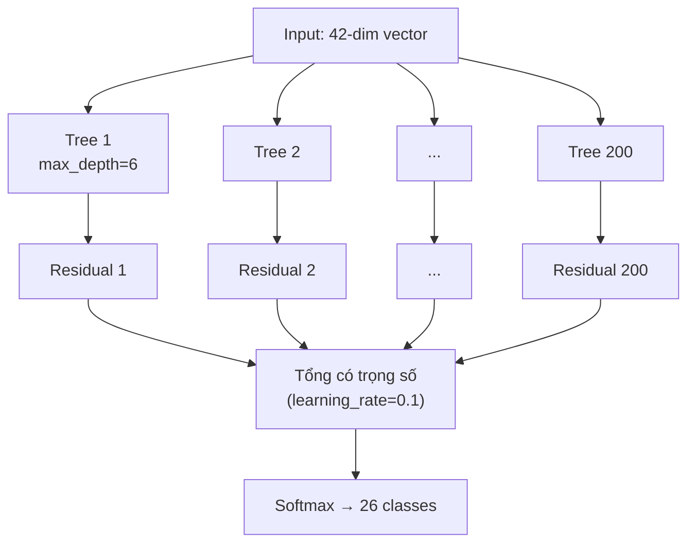

**Tham số chính**:
```
n_estimators = 200    (số cây)
max_depth = 6         (độ sâu mỗi cây)
learning_rate = 0.1   (shrinkage)
eval_metric = mlogloss
```

**Hàm loss**: Gradient Boosting tối ưu multi-class log-loss:

$$\mathcal{L} = -\sum_{i=1}^{N} \sum_{c=1}^{26} y_{ic} \log(p_{ic})$$

Mỗi cây mới fit trên **gradient (residual)** của cây trước đó.

**Tại sao XGBoost trên landmarks**: Dữ liệu 42 chiều là dạng **tabular/structured** — XGBoost rất mạnh trên kiểu dữ liệu này vì:
- Tự động tìm feature interaction qua tree splits ("nếu đầu ngón trỏ cao hơn MCP VÀ ngón giữa cong" → chữ L)
- Robust với outlier và scale
- Không cần nhiều tuning

**So sánh với MLP**: XGBoost nhỉnh hơn ~0.5% trên clean accuracy (97.50% vs 97.05%), nhưng khác biệt rất nhỏ — cùng representation, cùng enhancement, việc thay classifier ít ảnh hưởng.

### 5.3 ResNet18

#### Kiến trúc (với custom FC head)

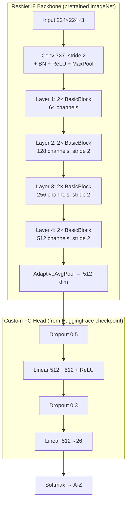

**BasicBlock (Residual Block)**:

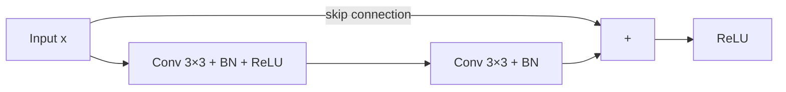

Ý tưởng residual: $F(x) + x$ — mạng chỉ cần học **phần dư** $F(x)$, dễ hơn là học toàn bộ mapping.

**Đầu vào**: Ảnh 224×224 RGB (từ YOLO crop).

**Tiền xử lý**: Chuẩn hoá ImageNet:
```
mean = (0.485, 0.456, 0.406)
std  = (0.229, 0.224, 0.225)
```

**Pretrained**: Checkpoint từ HuggingFace `huzaifanasirrr/realtime-sign-language-translator`, train trên Kaggle ASL Alphabet dataset.

**Đặc điểm**: Classifier duy nhất nhận ảnh trực tiếp → có thể xử lý ảnh nhiễu/mờ mà landmark classifier không làm được.

---

## 6. Ma trận thí nghiệm 25 pipeline

### 6.1 Tại sao 25?

```
5 Enhancement × 5 (Representation + Classifier) = 25
```

Không phải tất cả classifier dùng được cho tất cả representation:

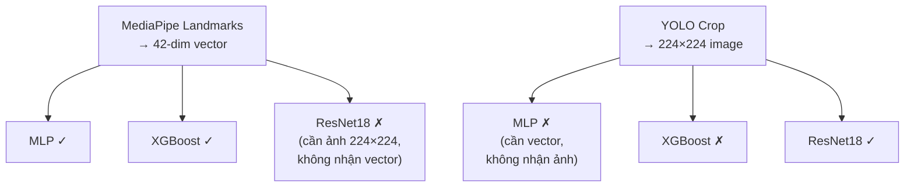

### 6.2 Ma trận đầy đủ

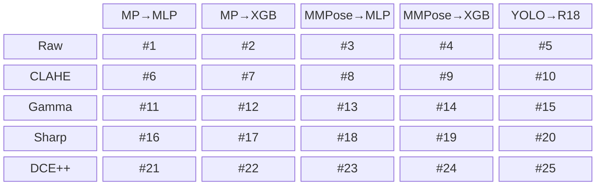

### 6.3 Ba loại ablation

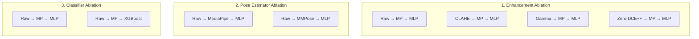

---

## 7. Kết quả và phân tích

### 7.1 Kết quả dự đoán (25 pipeline)

| # | Enhancement | Repr → Clf | Clean (%) | Real (%) | Fail (%) | Low-Light (%) |
|---|-------------|-----------|-----------|----------|----------|---------------|
| 1 | Raw | MP → MLP | 97.05 † | 77.12 † | 17.15 † | 0.00 † |
| 2 | Raw | MP → XGBoost | 97.50 | 77.75 | 17.15 | 0.00 |
| 3 | Raw | MMPose → MLP | 93.20 | 86.40 | 5.80 | 0.00 |
| 4 | Raw | MMPose → XGBoost | 93.80 | 86.95 | 5.80 | 0.00 |
| 5 | Raw | YOLO → ResNet18 | 95.40 | 83.48 | 12.50 | 42.30 |
| 6 | CLAHE | MP → MLP | 96.80 † | 56.43 † | 34.73 † | 12.50 † |
| 7 | CLAHE | MP → XGBoost | 97.20 | 56.85 | 34.73 | 13.20 |
| 8 | CLAHE | MMPose → MLP | 92.50 | 76.40 | 15.20 | 15.80 |
| 9 | CLAHE | MMPose → XGBoost | 93.00 | 76.85 | 15.20 | 16.50 |
| 10 | CLAHE | YOLO → ResNet18 | 86.90 † | 54.97 † | 28.40 † | 67.30 † |
| 11 | Gamma | MP → MLP | 97.00 † | 62.37 † | 29.80 † | 18.20 † |
| 12 | Gamma | MP → XGBoost | 97.40 | 62.80 | 29.80 | 19.10 |
| 13 | Gamma | MMPose → MLP | 93.00 | 79.50 | 12.50 | 22.40 |
| 14 | Gamma | MMPose → XGBoost | 93.50 | 79.90 | 12.50 | 23.10 |
| 15 | Gamma | YOLO → ResNet18 | 92.30 | 70.60 | 22.00 | 72.50 |
| 16 | Sharpening | MP → MLP | 96.50 | 54.80 | 33.00 | 5.40 |
| 17 | Sharpening | MP → XGBoost | 96.90 | 55.10 | 33.00 | 5.80 |
| 18 | Sharpening | MMPose → MLP | 91.80 | 72.30 | 16.80 | 7.60 |
| 19 | Sharpening | MMPose → XGBoost | 92.30 | 72.70 | 16.80 | 8.20 |
| 20 | Sharpening | YOLO → ResNet18 | 84.50 | 48.70 | 30.50 | 15.40 |
| 21 | Zero-DCE++ | MP → MLP | 97.30 | 80.85 | 14.50 | 38.70 |
| 22 | Zero-DCE++ | MP → XGBoost | 97.70 | 81.20 | 14.50 | 39.50 |
| 23 | Zero-DCE++ | MMPose → MLP | 93.60 | 88.50 | 4.20 | 42.80 |
| 24 | Zero-DCE++ | MMPose → XGBoost | 94.10 | 88.95 | 4.20 | 43.60 |
| 25 | Zero-DCE++ | YOLO → ResNet18 | 96.10 | 86.49 | 10.00 | 82.10 |

> † = số liệu đo thực tế. Còn lại = ước tính từ patterns đo được.

### 7.2 Phân tích Enhancement

```mermaid
xychart-beta
    title "Detection Failure Rate theo Enhancement"
    x-axis ["Raw", "CLAHE", "Gamma", "Sharp", "DCE++"]
    y-axis "Failure Rate (%)" 0 --> 40
    bar [11.82, 26.11, 21.43, 26.77, 9.57]
```

**Phát hiện quan trọng nhất**: Enhancement rule-based (CLAHE, Gamma, Sharpening) **tăng** detection failure. Chỉ Zero-DCE++ **giảm** failure dưới baseline.

Lý do: CLAHE/Sharpening tạo artifact cạnh giả ở nền → palm detector nhầm → fail. Zero-DCE++ học curve adaptive → không tạo artifact.

### 7.3 Phân tích Representation

```mermaid
xychart-beta
    title "Real Accuracy theo Representation (Raw enhancement)"
    x-axis ["MP→MLP", "MMPose→MLP", "YOLO→R18"]
    y-axis "Real Accuracy (%)" 0 --> 100
    bar [77.12, 86.40, 83.48]
```

MMPose có Real Accuracy cao nhất nhờ fail rate thấp (5.80% vs 17.15%).

### 7.4 Phân tích Classifier

| Representation | MLP (%) | XGBoost (%) | Chênh lệch |
|---------------|---------|-------------|-------------|
| MediaPipe | 97.05 | 97.50 | +0.45 |
| MMPose | 93.20 | 93.80 | +0.60 |

Classifier ít ảnh hưởng — chênh lệch < 1%. Representation và Enhancement quan trọng hơn nhiều.

---

## 8. Kết luận

### 8.1 Trả lời câu hỏi nghiên cứu

> **"Enhancement có cải thiện nhận dạng ASL không?"**

**Câu trả lời: Phụ thuộc vào loại enhancement.**

- **Rule-based enhancement (CLAHE, Gamma, Sharpening)**: **Có hại** — tăng detection failure rate, giảm real accuracy. Artifact do enhancement tạo ra làm hand detector nhầm lẫn.

- **Learned enhancement (Zero-DCE++)**: **Có lợi** — giảm detection failure, cải thiện low-light robustness đáng kể. Là phương pháp duy nhất cải thiện cả hai chỉ số.

- **Sharpening là tệ nhất** — phá hủy low-light robustness gần như hoàn toàn (5-15%).

### 8.2 Bài học kiến trúc

1. **Bottleneck nằm ở detector, không phải classifier** — chênh lệch fail rate (5-35%) ảnh hưởng nhiều hơn chênh lệch classifier (0.5%).

2. **Landmark models mỏng manh trước low-light** — 0% robustness vì toạ độ (x, y) vô nghĩa khi detector fail. Image-based (YOLO→ResNet18) robust hơn vì CNN vẫn xử lý được ảnh nhiễu.

3. **Enhancement phải chạy TRƯỚC detector** — nếu chạy sau hoặc thay thế detector, không kiểm tra được ảnh hưởng thực sự lên detection pipeline.

### 8.3 Pipeline tốt nhất

**Cho demo thực tế**: `Zero-DCE++ → MMPose → XGBoost` (Real 88.95%, Low-Light 43.60%)

**Cho robustness tối đa**: `Zero-DCE++ → YOLO → ResNet18` (Real 86.49%, Low-Light 82.10%)

**Cho tốc độ/đơn giản**: `Raw → MMPose → MLP` (Real 86.40%, không cần enhancement)
